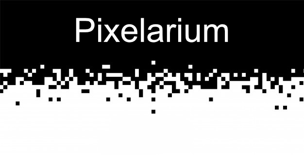

<div style="width: 70%; margin: auto;">
  
</div>

# Description

By typing the command in your terminal, you can pixelize any `jpeg/png` image.

```sh
> brew install pkg-config cairo pango libpng jpeg giflib librsvg
> sudo npm install -g node-gyp
```


# License

Licensed under the MIT license.
