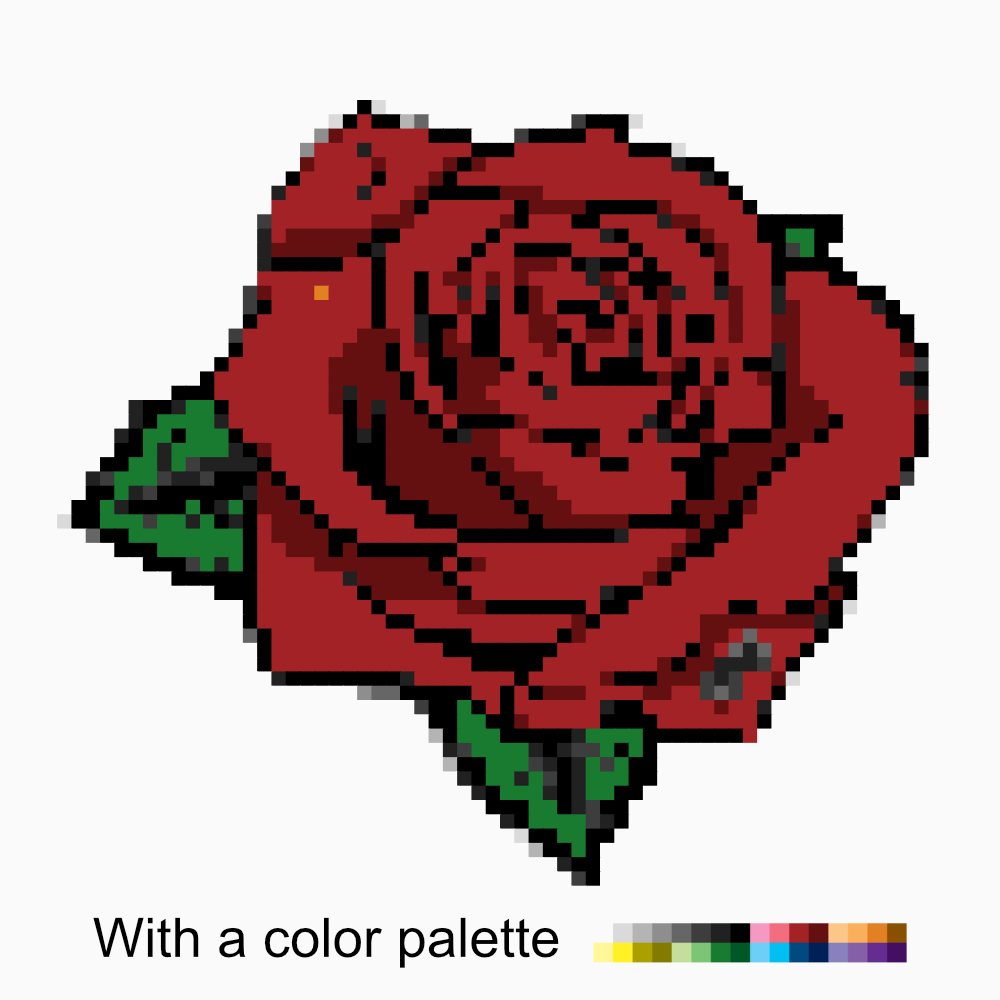

# Description
<div style="display: flex">
  <div style="width: 100%; margin: 2rem auto;">
    
  </div>
</div>

<p align="center" style="width: 30%; margin: 2rem auto;">
  
</p>

This project allows you to style an image by replacing several pixels with a smaller number.

## Features

You can use a color palette.

The pixels have 2 possible of shapes :
- square
- dots

You also have video functionality with the `renderVideo` method.

## Installation

```sh
> brew install ffmpeg
> brew install pkg-config cairo pango libpng jpeg giflib librsvg
> sudo npm install -g node-gyp
> npm install
```

## Examples

```typescript
import { Pixelize } from './Pixelize';

Pixelize.minimize('./rose.jpg', './output.png', 100, { shape: 'dots' });
Pixelize.renderVideo('./rose.jpg', './output.mp4', 20, 100, 60, { shape: 'dots' });
```

# License

Licensed under the MIT license.
